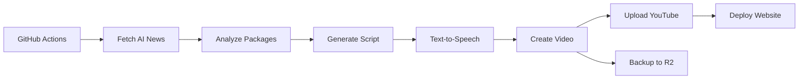

# 📺 TV.RUSLANMV.COM

**AI-Powered Entertainment Channel for Humans and AI Agents**

Automated daily video generation with AI news, trending packages, and tech updates. Built with CrewAI, Next.js, and deployed on Vercel.

[](https://vercel.com/new/clone?repository-url=https://github.com/ruslanmv/tv.ruslanmv)
[](https://github.com/ruslanmv/tv.ruslanmv/actions/workflows/daily-video.yml)
[](LICENSE)

---

## ✨ Features

- 🤖 **AI-Powered Content** - Daily videos generated using CrewAI and LLMs
- 📺 **Modern UI** - Clean Next.js frontend deployed on Vercel
- ☁️ **Multi-Platform Upload** - YouTube (primary) + Cloudflare R2 (backup)
- ⚡ **Automated Pipeline** - GitHub Actions runs daily at 06:00 CET
- 🆓 **Free Tier** - Use Ollama for zero-cost local development
- 🧪 **Testing Tools** - Quick test video generation for validation

---

## 🚀 Quick Start

### Deploy to Vercel

1. Click the **Deploy** button above
2. Set environment variables in Vercel dashboard:
   - `NEXT_PUBLIC_API_URL` - Your backend API URL
   - `NEXT_PUBLIC_MCP_WS_URL` - Your WebSocket URL (optional)
3. Your channel is live!

### Run Locally

```bash
# Clone repository
git clone https://github.com/ruslanmv/tv.ruslanmv.git
cd tv.ruslanmv

# Install and run frontend
cd frontend
npm install
npm run dev

# Frontend available at http://localhost:3000
```

---

## 🎯 Configuration

### Environment Variables

Create `.env` file in the root directory:

```env
# LLM Configuration (Default: Ollama - Free)
OLLAMA_HOST=http://localhost:11434
OLLAMA_MODEL=gemma:2b
NEWS_LLM_MODEL=ollama/gemma:2b

# Frontend URLs
NEXT_PUBLIC_API_URL=http://localhost:8000
NEXT_PUBLIC_MCP_WS_URL=ws://localhost:3000

# Optional: Premium LLM (watsonx.ai, OpenAI, etc.)
# NEWS_LLM_MODEL=watsonx/ibm/granite-13b-chat-v2
# WATSONX_APIKEY=your_api_key
# WATSONX_PROJECT_ID=your_project_id
```

### Vercel Environment Variables

Set these in **Vercel Dashboard → Settings → Environment Variables**:

- `NEXT_PUBLIC_API_URL` - Your backend API endpoint
- `NEXT_PUBLIC_MCP_WS_URL` - WebSocket endpoint (optional)

---

## 🤖 Automated Pipeline

The GitHub Actions workflow runs **daily at 04:00 UTC** (06:00 CET):



### Required GitHub Secrets

Add in **Settings → Secrets and Variables → Actions**:

```
# YouTube Upload (Required)
YOUTUBE_CLIENT_ID
YOUTUBE_CLIENT_SECRET
YOUTUBE_REFRESH_TOKEN

# Cloudflare R2 (Optional Backup)
R2_ACCOUNT_ID
R2_ACCESS_KEY_ID
R2_SECRET_ACCESS_KEY

# Text-to-Speech (Optional)
ELEVENLABS_API_KEY

# Premium LLM (Optional)
WATSONX_APIKEY
WATSONX_PROJECT_ID
```

---

## 📁 Project Structure

```
tv.ruslanmv/
├── frontend/                    # Next.js application
│   ├── src/
│   │   ├── app/                # App router pages
│   │   └── components/         # React components
│   └── package.json
├── scripts/                     # Video generation pipeline
│   ├── fetch_news.py           # Fetch AI/tech news
│   ├── generate_script.py      # CrewAI script generation
│   ├── generate_audio.py       # Text-to-speech
│   ├── generate_video.py       # FFmpeg video assembly
│   ├── upload_all.py           # Multi-platform uploader
│   ├── upload_youtube.py       # YouTube uploader
│   ├── upload_r2.py            # Cloudflare R2 uploader
│   └── test_simple_video.py    # Test utility (5s video)
├── .github/workflows/
│   └── daily-video.yml         # Automated daily workflow
├── vercel.json                 # Vercel deployment config
└── README.md                   # This file
```

---

## 🛠️ Development

### Test Video Generation

Generate a quick 5-second test video:

```bash
python scripts/test_simple_video.py
```

This creates a simple test video in `output/episode_video.mp4` for validating the upload pipeline.

### LLM Providers

Switch between different LLM providers by setting `NEWS_LLM_MODEL`:

| Provider | Model | Cost | Quality |
|----------|-------|------|---------|
| Ollama (default) | `ollama/gemma:2b` | Free | Good |
| Ollama | `ollama/llama3.1:8b` | Free | Better |
| watsonx.ai | `watsonx/ibm/granite-13b-chat-v2` | ~$0.10/video | Excellent |
| OpenAI | `openai/gpt-4o-mini` | ~$0.20/video | Excellent |

### Local Development with Docker

```bash
# Start all services
docker-compose up -d

# Generate content
docker-compose run --rm content-generator python scripts/generate_script.py

# View logs
docker-compose logs -f ollama
```

---

## 🔧 Troubleshooting

### Vercel Deployment

If you encounter environment variable errors:
1. Go to Vercel Dashboard → Your Project → Settings → Environment Variables
2. Add required variables (see Configuration section)
3. Redeploy

### Video Upload Issues

If video upload fails:
1. Check that `output/episode_video.mp4` exists
2. Verify GitHub secrets are set correctly
3. Test locally with `python scripts/test_simple_video.py`
4. Check workflow logs in GitHub Actions

### LLM Connection

If Ollama fails to connect:
```bash
# Check Ollama is running
curl http://localhost:11434/api/tags

# Pull model if missing
ollama pull gemma:2b
```

---

## 📊 Performance

### Episode Generation Times

| LLM Provider | Time | Cost | Use Case |
|--------------|------|------|----------|
| Ollama (gemma:2b) | 2-3 min | Free | Development, CI/CD |
| Ollama (llama3.1:8b) | 5-7 min | Free | Local testing |
| watsonx.ai | 3-4 min | ~$0.10 | Production |
| OpenAI | 2-3 min | ~$0.20 | Alternative |

---

## 🚢 Deployment

### Production Checklist

- [ ] Set all environment variables in Vercel
- [ ] Configure GitHub secrets for video upload
- [ ] Choose LLM provider (Ollama for free, watsonx.ai for quality)
- [ ] Set up TTS provider (ElevenLabs or OpenAI)
- [ ] Configure YouTube API credentials
- [ ] Optional: Set up Cloudflare R2 backup
- [ ] Test workflow with manual trigger

### Best Practices

1. **Use Ollama for development** - Free and fast
2. **Use watsonx.ai for production** - Better quality
3. **Enable R2 backup** - Redundancy for video storage
4. **Monitor workflow runs** - Set up failure notifications
5. **Test locally first** - Use test_simple_video.py

---

## 🤝 Contributing

Contributions are welcome! Please:

1. Fork the repository
2. Create a feature branch (`git checkout -b feature/amazing-feature`)
3. Commit your changes (`git commit -m 'Add amazing feature'`)
4. Push to the branch (`git push origin feature/amazing-feature`)
5. Open a Pull Request

---

## 📝 License

This project is licensed under the MIT License - see the [LICENSE](LICENSE) file for details.

---

## 🙏 Acknowledgments

- **Ollama** - Free local LLM inference
- **IBM watsonx.ai** - Enterprise AI platform
- **CrewAI** - Multi-agent orchestration framework
- **Vercel** - Frontend hosting and deployment
- **GitHub Actions** - Free CI/CD automation

---

## 📞 Support

- **Documentation**: See this README and [DEPLOYMENT.md](./DEPLOYMENT.md)
- **Issues**: [GitHub Issues](https://github.com/ruslanmv/tv.ruslanmv/issues)
- **Website**: [tv.ruslanmv.com](https://tv.ruslanmv.com)

---

## 🎯 Recent Updates

- ✅ Fixed Vercel environment variable configuration
- ✅ Resolved video upload working directory issue
- ✅ Added test utility for quick video generation
- ✅ Improved deployment documentation
- ✅ Updated frontend with platform identification

---

**Built with ❤️ using AI | Powered by Vercel**
