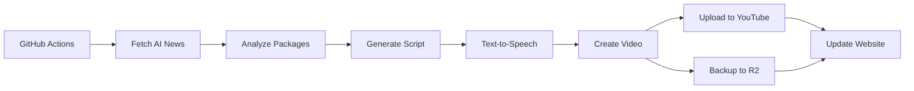

# 📺 TV.RUSLANMV.COM

**The First AI-Powered Entertainment Channel for Humans and AI Agents**

Automated daily video generation with AI news, trending packages, and tech updates. Powered by CrewAI, Next.js, and Cloudflare.

[](https://vercel.com/new/clone?repository-url=https://github.com/ruslanmv/tv.ruslanmv)
[](https://github.com/ruslanmv/tv.ruslanmv/actions/workflows/daily-video.yml)
[](LICENSE)

---

## ✨ Features

- 🤖 **AI-Powered Content**: Daily videos generated using CrewAI and LLMs
- 📺 **Minimalist UI**: Clean, professional Next.js frontend
- ☁️ **Multi-Platform Upload**: YouTube (primary) + Cloudflare R2 (backup)
- ⚡ **Automated Pipeline**: GitHub Actions runs daily video generation
- 🔬 **Colab Support**: Generate videos manually via Google Colab
- 🌐 **Vercel Ready**: One-click deployment to Vercel
- 🆓 **Free Tier Available**: Use Ollama for zero-cost development

---

## 🚀 Quick Start

### Option 1: Deploy to Vercel (Fastest)

1. Click the **Deploy** button above
2. Configure environment variables
3. Your channel is live! 🎉

### Option 2: Run Locally

```bash
# Clone repository
git clone https://github.com/ruslanmv/tv.ruslanmv.git
cd tv.ruslanmv

# Install frontend dependencies
cd frontend
npm install
npm run dev

# Frontend runs at http://localhost:3000
```

### Option 3: Generate Videos with Colab

1. Open [`colab/generate_video.ipynb`](./colab/generate_video.ipynb) in Google Colab
2. Add your API keys in Colab Secrets
3. Run all cells
4. Videos upload automatically to YouTube and R2

---

## 🎯 LLM Configuration

### Default: Ollama (Free & Local)

```env
# .env
OLLAMA_HOST=http://localhost:11434
OLLAMA_MODEL=gemma:2b
NEWS_LLM_MODEL=ollama/gemma:2b
```

**Available Models:**
- `gemma:2b` - Fast, small (DEFAULT)
- `llama3.1:8b` - Better quality
- `mistral:7b` - Alternative

### Optional: watsonx.ai (Better Quality)

```env
# .env
NEWS_LLM_MODEL=watsonx/ibm/granite-13b-chat-v2
WATSONX_APIKEY=your_api_key
WATSONX_PROJECT_ID=your_project_id
WATSONX_URL=https://us-south.ml.cloud.ibm.com
```

Get API key: https://cloud.ibm.com/

**Available Models:**
- `watsonx/ibm/granite-13b-chat-v2` - IBM's model
- `watsonx/meta-llama/llama-3-1-70b-instruct` - Best quality
- `watsonx/ibm/granite-20b-multilingual` - Multilingual

---

## 🤖 Automated Daily Pipeline

### How It Works



The workflow runs **every day at 04:00 UTC** (06:00 CET) and:

1. ✅ **Setup** - Python, FFmpeg, Ollama
2. 📰 **Fetch News** - Latest AI/tech news
3. 📦 **Analyze Packages** - Trending tools
4. ✍️ **Generate Script** - Using CrewAI + LLM
5. 🎤 **Create Audio** - Text-to-speech
6. 🎨 **Generate Video** - Visuals + subtitles
7. 📤 **Upload to All Platforms** - YouTube + R2
8. 💾 **Update Database** - Episode metadata
9. 🌐 **Deploy Website** - Vercel

### Required Secrets (GitHub Actions)

Add these in **Settings → Secrets → Actions**:

```
# YouTube (required for upload)
YOUTUBE_CLIENT_ID
YOUTUBE_CLIENT_SECRET
YOUTUBE_REFRESH_TOKEN

# Cloudflare R2 (optional backup)
R2_ACCOUNT_ID
R2_ACCESS_KEY_ID
R2_SECRET_ACCESS_KEY
```

### Optional Secrets

```
# Better TTS quality
ELEVENLABS_API_KEY

# Premium LLM (instead of free Ollama)
WATSONX_APIKEY
WATSONX_PROJECT_ID
```

See [DEPLOYMENT.md](./DEPLOYMENT.md) for complete setup guide.

---

## 📁 Project Structure

```
tv.ruslanmv/
├── frontend/              # Next.js minimalist UI
│   ├── src/
│   │   ├── app/          # Next.js 14 app router
│   │   └── components/   # React components (TVPlayer)
│   └── package.json
├── scripts/              # Video generation pipeline
│   ├── fetch_news.py     # Fetch AI news
│   ├── generate_script.py # CrewAI script generation
│   ├── generate_video.py  # FFmpeg video assembly
│   ├── upload_youtube.py  # YouTube uploader
│   ├── upload_r2.py       # Cloudflare R2 uploader
│   └── upload_all.py      # Multi-platform uploader
├── colab/                # Google Colab notebooks
│   └── generate_video.ipynb
├── .github/workflows/    # CI/CD automation
│   └── daily-video.yml   # Daily video generation
├── vercel.json           # Vercel deployment config
└── DEPLOYMENT.md         # Complete deployment guide
```

---

## 🛠️ Development

### Local Development

```bash
# Start services
docker-compose up -d

# Test Ollama
curl http://localhost:11434/api/generate \
  -d '{
    "model": "gemma:2b",
    "prompt": "Hello, world!",
    "stream": false
  }'

# Generate script
docker-compose run --rm content-generator \
  python scripts/generate_script.py

# View logs
docker-compose logs -f ollama
docker-compose logs -f content-generator
```

### Test LLM Client

```bash
# Test with Ollama (default)
docker-compose run --rm content-generator \
  python scripts/llm_client.py

# Test with watsonx.ai
docker-compose run --rm content-generator \
  sh -c "NEWS_LLM_MODEL=watsonx/ibm/granite-13b-chat-v2 python scripts/llm_client.py"
```

### Switch LLM Providers

```bash
# Use Ollama (default)
NEWS_LLM_MODEL=ollama/gemma:2b

# Use watsonx.ai
NEWS_LLM_MODEL=watsonx/ibm/granite-13b-chat-v2

# Use OpenAI
NEWS_LLM_MODEL=openai/gpt-4o-mini

# Use Anthropic
NEWS_LLM_MODEL=anthropic/claude-3-5-sonnet-latest
```

---

## 📊 Costs Comparison

### Ollama (Default)
- **Cost**: $0.00 FREE
- **Setup**: Automatic
- **Quality**: Good
- **Speed**: Fast
- **Use case**: Development, CI/CD

### watsonx.ai (Optional)
- **Cost**: ~$0.10 per episode
- **Setup**: API key needed
- **Quality**: Excellent
- **Speed**: Medium
- **Use case**: Production

### OpenAI
- **Cost**: ~$0.20 per episode
- **Setup**: API key needed
- **Quality**: Excellent
- **Speed**: Fast
- **Use case**: Alternative

---

## 🔧 Configuration

### Ollama Configuration

```yaml
# docker-compose.yml
ollama:
  image: ollama/ollama:latest
  ports:
    - "11434:11434"
  volumes:
    - ollama_data:/root/.ollama
  deploy:
    resources:
      reservations:
        devices:
          - driver: nvidia
            count: all
            capabilities: [gpu]  # Optional GPU acceleration
```

### GitHub Actions Configuration

```yaml
# .github/workflows/daily-video.yml
on:
  schedule:
    - cron: "0 4 * * *"  # 04:00 UTC = 06:00 CET
  workflow_dispatch:  # Manual trigger

env:
  OLLAMA_HOST: "http://127.0.0.1:11434"
  OLLAMA_MODEL: "gemma:2b"
  NEWS_LLM_MODEL: "ollama/gemma:2b"
```

---

## 📈 Performance

### Episode Generation Times

| LLM Provider | Average Time | Cost | Quality |
|-------------|--------------|------|---------|
| Ollama (gemma:2b) | 2-3 min | Free | Good |
| Ollama (llama3.1:8b) | 5-7 min | Free | Better |
| watsonx.ai (granite-13b) | 3-4 min | ~$0.10 | Excellent |
| OpenAI (gpt-4o-mini) | 2-3 min | ~$0.20 | Excellent |

---

## 🚢 Deployment

### Production Recommendations

1. **Use watsonx.ai** for better quality
2. **Enable caching** for repeated requests
3. **Monitor costs** if using paid providers
4. **Setup alerts** for failed workflows
5. **Backup database** regularly

### GitHub Actions Best Practices

```yaml
# Use secrets for sensitive data
env:
  WATSONX_APIKEY: ${{ secrets.WATSONX_APIKEY }}
  YOUTUBE_CLIENT_SECRET: ${{ secrets.YOUTUBE_CLIENT_SECRET }}

# Add failure notifications
- name: Send failure notification
  if: failure()
  run: |
    curl -X POST ${{ secrets.SLACK_WEBHOOK }} \
      -d '{"text":"❌ Episode generation failed"}'
```

---

## 🤝 Contributing

Contributions welcome! Please:

1. Fork the repository
2. Create a feature branch
3. Test with both Ollama and watsonx.ai
4. Submit a pull request

---

## 📝 License

MIT License - see [LICENSE](LICENSE)

---

## 🙏 Acknowledgments

- **Ollama** - Free local LLM inference
- **IBM watsonx.ai** - Enterprise AI platform
- **CrewAI** - Multi-agent orchestration
- **GitHub Actions** - Free CI/CD automation

---

## 📞 Support

- **Documentation**: Included in this repo
- **Issues**: [GitHub Issues](https://github.com/ruslanmv/tv.ruslanmv.com/issues)
- **Email**: support@ruslanmv.com

---

## 🎯 Roadmap

- [x] Ollama integration (default LLM)
- [x] watsonx.ai support (optional)
- [x] GitHub Actions automation
- [x] Daily video generation at 6 AM CET
- [ ] Multi-language support
- [ ] Live streaming
- [ ] Interactive AI chat
- [ ] Mobile app

---

**"The First TV Channel Where AI Learns and Humans Watch - Now 100% Free!"** 🤖📺👨‍💻

**Powered by Ollama | Enhanced by watsonx.ai**
